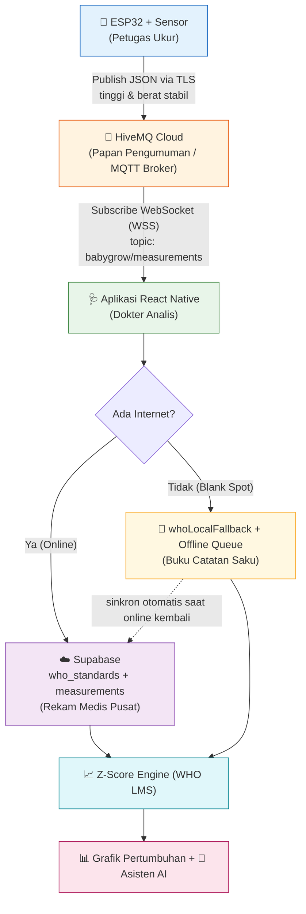

# Modul Pembelajaran & Arsitektur Sistem BabyGrow

> **Dokumen ini ditujukan untuk audiens non-teknis** — Dinas Kesehatan, mitra Posyandu, dan investor — sekaligus tetap akurat secara teknis bagi tim pengembang. Semua istilah teknis dijelaskan dengan analogi klinis agar mudah dipahami.

**Versi Dokumen:** 1.0
**Produk:** BabyGrow — Sistem Pemantauan Pertumbuhan Balita Terintegrasi IoT
**Standar Medis:** WHO Child Growth Standards (LMS / Z-Score)

---

## 1. Ringkasan Eksekutif

BabyGrow adalah sistem terpadu yang menghubungkan **alat ukur fisik (IoT)** dengan **aplikasi cerdas** untuk memantau pertumbuhan balita secara **medis-akurat** dan **tahan gangguan sinyal**. Sistem ini mengubah proses penimbangan manual di Posyandu menjadi data digital yang otomatis dianalisis menggunakan standar pertumbuhan resmi Organisasi Kesehatan Dunia (WHO).

**Tiga janji utama BabyGrow:**

| Janji | Penjelasan Sederhana |
|-------|----------------------|
| **Akurat** | Setiap pengukuran langsung dibandingkan dengan kurva pertumbuhan WHO (Z-Score) untuk mendeteksi risiko *stunting*. |
| **Selalu Jalan** | Aplikasi tetap berfungsi penuh walau tidak ada internet (*Offline-First*). Data aman, sinkron otomatis saat sinyal kembali. |
| **Mudah** | Petugas cukup meletakkan balita di alat; angka muncul, tersimpan, dan dianalisis tanpa input manual yang rumit. |

---

## 2. Analogi Klinis: Siapa Berperan Sebagai Apa?

Bayangkan seluruh sistem BabyGrow sebagai sebuah **klinik pemeriksaan tumbuh kembang**. Setiap komponen teknologi memiliki "peran" seperti staf klinik:

| Komponen Teknis | Peran di "Klinik" | Tugas |
|-----------------|-------------------|-------|
| **ESP32 + Sensor** | 👷 **Petugas Ukur** | Menimbang berat & mengukur tinggi balita secara fisik, lalu membacakan angkanya. |
| **HiveMQ (MQTT Broker)** | 📢 **Papan Pengumuman Digital** | Menerima "pengumuman" angka dari Petugas Ukur dan menyiarkannya ke siapa pun yang mendengarkan. |
| **Aplikasi React Native** | 🩺 **Dokter Analis** | Mendengarkan papan pengumuman, mencatat, menganalisis dengan standar WHO, dan menjelaskan artinya ke orang tua. |
| **Supabase (Cloud DB)** | 🗄️ **Rekam Medis Pusat** | Menyimpan seluruh riwayat pertumbuhan secara permanen dan aman. |
| **Local Cache / Queue** | 📓 **Buku Catatan Saku Dokter** | Cadangan lokal saat internet mati — dokter tetap bisa bekerja, catatan dipindah ke rekam medis pusat nanti. |

> **Inti filosofi:** Petugas Ukur (ESP32) hanya bertugas **membacakan angka**. Ia tidak pernah mendiagnosis. Seluruh kecerdasan medis ada di tangan Dokter Analis (aplikasi), sehingga logika kesehatan selalu terpusat, konsisten, dan mudah diperbarui.

---

## 3. Alur Data End-to-End

Berikut perjalanan sebuah angka pengukuran, dari alat fisik hingga menjadi analisis yang dipahami orang tua:

**Penjelasan tiap tahap:**

1. **Pengukuran fisik** — ESP32 membaca sensor tinggi (VL53L1X) dan berat (HX711/load cell), lalu menunggu nilai **stabil** sebelum mengirim.
2. **Penyiaran** — Data dikirim sebagai pesan JSON ke HiveMQ melalui koneksi terenkripsi (TLS).
3. **Penerimaan** — Aplikasi berlangganan (*subscribe*) ke papan pengumuman dan langsung menangkap angka baru.
4. **Analisis** — Aplikasi menghitung Z-Score terhadap standar WHO dan menentukan status (Normal / Berisiko / Stunting).
5. **Penyimpanan** — Data disimpan ke Rekam Medis Pusat (Supabase) bila online, atau ke Buku Catatan Saku (lokal) bila offline.

---

## 4. Bab Khusus: Offline-First Architecture & WHO Z-Score Engine

### 4.1 Mengapa "Offline-First" Wajib untuk Posyandu?

Banyak Posyandu berada di daerah dengan sinyal internet yang tidak stabil (*blank spot*). Sistem yang bergantung penuh pada internet akan **berhenti bekerja** persis saat paling dibutuhkan. BabyGrow dirancang **Offline-First**: internet dianggap sebagai *bonus*, bukan syarat.

> **Analogi:** Seorang dokter yang baik tidak berhenti memeriksa pasien hanya karena telepon klinik mati. Ia mencatat di buku saku, dan menyalin ke rekam medis pusat nanti. Itulah yang dilakukan BabyGrow.

### 4.2 Bagaimana Sistem Mengambil Alih Fungsi Cloud

Perhitungan Z-Score idealnya memakai tabel standar WHO yang tersimpan di cloud (`who_standards` di Supabase). Namun bila cloud tidak terjangkau, aplikasi **otomatis beralih** ke salinan tabel WHO yang tertanam di dalam aplikasi: **`whoLocalFallback`**.

Mekanisme ini memakai pola ***Circuit Breaker*** (pemutus arus):

| Kondisi | Yang Terjadi | Hasil untuk Pengguna |
|---------|--------------|----------------------|
| **Online & cloud sehat** | Ambil LMS dari `who_standards` (Supabase). | Z-Score presisi penuh. |
| **Cloud lambat / gagal / offline** | *Circuit breaker* memutus, langsung pakai `whoLocalFallback`. | **Z-Score tetap keluar** — tanpa menunggu / tanpa error. |
| **Kembali online** | Data yang dihitung offline **disinkronkan** ke Supabase. | Riwayat lengkap, tidak ada data hilang. |

**Tabel LMS lokal** (`whoLocalFallback.ts`) menyimpan tiga indikator kunci beserta interpolasi linear antar-titik usia/tinggi:

- **HFA** — *Height-for-Age* (Tinggi menurut Umur → indikator utama *stunting*).
- **WFA** — *Weight-for-Age* (Berat menurut Umur).
- **WFH** — *Weight-for-Height* (Berat menurut Tinggi → indikator gizi akut).

### 4.3 Rumus Z-Score WHO (LMS / Box-Cox)

Engine memakai metode resmi WHO **LMS (Lambda-Mu-Sigma)**:

> **Bila L ≠ 0:**  `Z = ((X / M)^L − 1) / (L × S)`
>
> **Bila L = 0:**  `Z = ln(X / M) / S`

Di mana **X** = nilai ukur balita, **M** = median WHO, **S** = koefisien variasi, **L** = parameter kemiringan distribusi. Rumus yang **sama persis** dipakai di cloud maupun lokal, sehingga hasil selalu konsisten di mana pun dihitung.

---

## 5. Bab Khusus: Resolusi "Deadlock Stabilitas"

### 5.1 Masalah yang Ditemukan

Saat uji integrasi menyeluruh (*End-to-End*), ditemukan gejala berbahaya: **angka pengukuran muncul di layar, tetapi tidak pernah tersimpan** ke grafik maupun AI. Ini terjadi karena adanya **dua "penjaga gerbang" kestabilan** yang saling meniadakan:

> **Analogi:** Bayangkan dua satpam yang terlalu ketat. Satpam pertama (alat fisik) hanya mau meneruskan angka jika sangat-sangat mirip dengan yang sebelumnya. Satpam kedua (aplikasi) baru mau mencatat jika menerima **beberapa angka berturut-turut yang nyaris identik**. Akibatnya: satpam pertama menyaring habis variasi, satpam kedua tidak pernah dapat cukup sampel — **tidak ada yang lolos, data macet.**

### 5.2 Akar Masalah Teknis

- **Sisi Aplikasi** (`MeasurementSyncService`) mensyaratkan **5 sampel berturut-turut** dengan simpangan baku (standar deviasi) tinggi **≤ 0.35 cm** sebelum menyimpan.
- **Sisi Firmware** sudah melakukan penyaringan kestabilan sendiri **dan** deduplikasi (menolak nilai yang terlalu mirip). Kombinasi keduanya membuat aplikasi jarang menerima cukup variasi/sampel untuk memenuhi syaratnya.

### 5.3 Solusi: Melonggarkan Gerbang Stabilitas Aplikasi

Kami menyetel ulang parameter di sisi aplikasi agar **toleran terhadap getaran alami (*jitter*) sensor fisik**, tanpa mengorbankan makna "stabil":

| Parameter | Sebelum (Terlalu Ketat) | Sesudah (Toleran & Realistis) | Arti |
|-----------|:-----------------------:|:-----------------------------:|------|
| **`WINDOW_SIZE`** | 5 sampel | **3 sampel** | Cukup 3 bacaan berurutan untuk mengunci nilai. |
| **`STABILITY_STD_CM`** | 0.35 cm | **0.8 cm** | Menolerir getaran wajar tangan/sensor. |
| **`RESET_JUMP_CM`** | 1.2 cm | **3.0 cm** | Tidak gampang "mereset" buffer karena lonjakan kecil. |

> **Hasil:** Rantai *alat → aplikasi* kembali mengalir. Data live yang stabil kini **konsisten tersimpan** ke grafik dan AI, sementara logika tetap menolak data yang benar-benar kacau (bukan sekadar bergetar).

**Catatan produksi:** Untuk penggunaan medis berskala penuh dengan hardware yang sudah dikalibrasi, parameter ini dapat dikembalikan lebih ketat demi presisi maksimal. Nilai di atas dioptimalkan untuk **stabilitas demo & lapangan** menggunakan sensor umum.

### 5.4 Lapisan Ketahanan Tambahan

- **Jaring pengaman mock** — bila hardware bermasalah saat demo langsung, aplikasi versi produksi tetap dapat menyuntikkan pengukuran simulasi (diaktifkan lewat `EXPO_PUBLIC_ALLOW_MOCK=1`).
- **Status terpisah** — antarmuka membedakan **"Broker: Terhubung"** (koneksi ke papan pengumuman) dari **"Alat: terakhir kirim X detik lalu"** (keaktifan alat fisik), sehingga petugas tidak salah mengira "online" berarti "alat sudah mengirim data".

---

## 6. Ringkasan Keamanan & Keandalan

| Aspek | Penerapan di BabyGrow |
|-------|-----------------------|
| **Enkripsi transport** | Semua komunikasi MQTT memakai TLS (port aman 8883/8884). |
| **Isolasi data** | *Row Level Security* (RLS) Supabase memastikan orang tua hanya mengakses data anaknya sendiri. |
| **Ketahanan sinyal** | *Offline-First* + antrian sinkronisasi otomatis, tanpa kehilangan data. |
| **Konsistensi medis** | Satu sumber rumus WHO LMS untuk cloud & lokal. |
| **Fail-safe demo** | Mode mock terkontrol sebagai cadangan saat perangkat keras gagal. |

---

## 7. Glosarium Singkat

- **IoT (Internet of Things):** Perangkat fisik yang terhubung ke internet — di sini, alat ukur ESP32.
- **MQTT:** Protokol pesan ringan, cocok untuk perangkat kecil dan jaringan tidak stabil.
- **Z-Score:** Ukuran seberapa jauh nilai anak dari nilai tengah (median) populasi sehat WHO. Nilai sekitar 0 = normal.
- **Stunting:** Kondisi tinggi badan jauh di bawah standar usia (Z-Score HFA < −2), indikator gizi kronis.
- **Offline-First:** Prinsip desain di mana aplikasi berfungsi penuh tanpa internet.

---

*Dokumen ini dapat diekspor ke PDF langsung dari editor Markdown apa pun (mis. "Export to PDF" di VS Code / Typora) atau melalui `pandoc Modul_Pembelajaran_BabyGrow.md -o Modul_BabyGrow.pdf`.*
